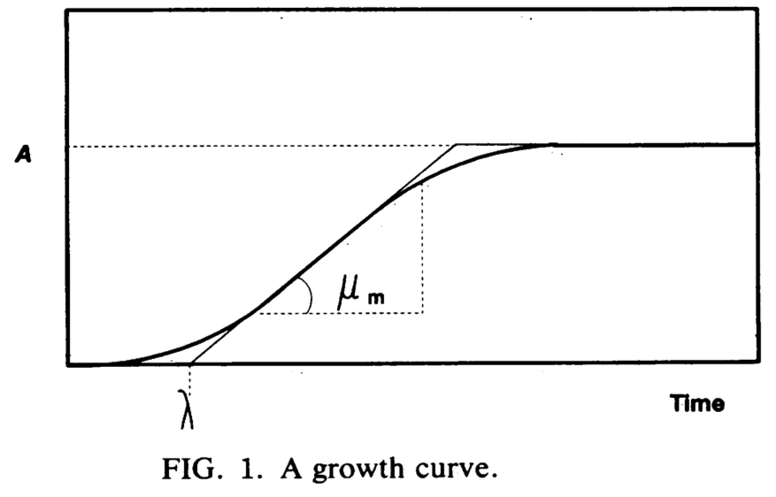

```{r setup}
library(tidyverse)
library(knitr)
library(kableExtra)
library(modelr)
library(broom)
#library(grofit)


```


# Column {.sidebar data-width='300%'}

## Growth Curve Fitting

Use this app to fit growth curves, whether it is one experiment or hundreds (e.g. from a plate reader).

-------

### Instructions

Start with some [example data](https://github.com/scott-saunders/labwork/blob/master/Growth_curve_fitting/data.zip).

1. **Upload** a .csv file of your data 
2. **Select Data** to be fit.
3. **Set Model Parameters** with a reasonable guess.
4. Examine **Model Fits** and check for errors.
5. View **Parameter Estimates**.
  * Use parameter estimates to inform model parameters for error datasets.
6. **Download** parameter estimates / best fit curves.


Enjoy! [-Scott Saunders](https://scott-saunders.github.io/website/)


-------

### Upload your data

Upload a .csv file where column 1 is "time" (in hrs). Data columns for each well / experiment follow. 

```{r}
fileInput("file1", label = '', multiple = FALSE, 
          accept = c("text/csv", "text/comma-separated-values,text/plain",".csv"))

df <- reactive({
  
  req(input$file1)
  
  df <- read_csv(input$file1$datapath)
  
  df_well_index <- tibble(well = colnames(df)[-1]) %>% mutate(well_index = row_number())

  df_wIndex <- left_join(df %>% gather(key = 'well',value = 'absorbance',-time), 
                         df_well_index, 
                         by = 'well' )
  
  
  return(df_wIndex)
  
})

```

-------

### Downloads

----

Parameter estimates of A, Lag, and Mu. Confidence intervals are included for gompertz models.

```{r}
df_ests_output <- reactive({
  
  if(input$model == 'gomp' | input$model == 'biGomp'){
  
  df_ests_output <- df_ests() %>% select(-c(data, fit_result, fit_errors, models, est_result, est_errors))
  
  } else{
    
    if(input$model == 'spline'){
      df_ests_output <- df_ests() %>% select(well, term, estimate)
    }
    
  }
  
  return(df_ests_output)
  
  })

 downloadHandler(
         filename = 'growth_curve_parameter_estimates.csv',
         outputArgs = list(label = 'Parameter estimates'),
         content = function(file) {
             write_csv(df_ests_output(), file)
         }
     )

```

-----

Best fit curves along with raw data.

```{r}

pred_file <- reactive({  
  
  pred_file <- df_preds()

  # if(input$biGomp){
  # 
  #   pred_file <- df_pred_ests()
  #   
  #   }
  
  })


downloadHandler(
  filename = 'growth_curve_model_fits.csv',
  outputArgs = list(label = 'Best fit curves'),
  content = function(file) { write_csv(pred_file() %>% select(-c(data, fit_result, fit_errors, models)), file)}
    )


```

# Dataset Overview{ data-orientation=rows}

## Plots

### Overview Plot

```{r}
renderPlot({
  
  ggplot(df(), aes(time, absorbance, group = well)) + geom_path()
  
})
```

## Tables

### Overview Table

```{r}
renderTable({
  
  df() %>% pivot_wider(id_cols = 'time', names_from = 'well', values_from = 'absorbance' )
  
})
```


# Select Data{ data-orientation=rows}

## Plots {data-height='300%'}

### Plot Selected Curves


```{r}

output$selection_plot <- renderPlot({
  
  ggplot(df() %>% filter(well %in% input$selected_wells), aes(time, absorbance, group = well)) + geom_path() + labs(title = 'Drag the box to select data')
  
})

plotOutput("selection_plot", brush = brushOpts(id = "selection_plot_brush"))

# Reactive that returns the whole dataset if there is no brush

selectedData <- reactive({
  data <- brushedPoints(df(), input$selection_plot_brush) 
  if (nrow(data) == 0)
    data <- df()
  data %>% filter(well %in% input$selected_wells)
})

```

### Plot Selected Data

```{r}

#output$select_plot <- 
  
  renderPlot({
  
  ggplot(selectedData(), aes(time, absorbance, color = well)) + geom_path() + scale_color_viridis_d() + theme(legend.position = 'bottom')
  
})

#plotOutput("select_plot", height = '300px')

#renderUI(list(tags$hr(),plotOutput("overview_plot", brush = brushOpts(id = "overview_plot_brush"), height = '50px'), tags$hr(), plotOutput("select_plot", height = '100px')))

```


## Select Wells{data-height='100%'}

### Select Subset of Growth Curves

```{r}
renderUI({
  list(
    sliderInput(inputId = 'well_range', label = 'Select a range of curves', min = 1, max = max(df()$well_index), value = c(1,max(df()$well_index)))
  )
})

```

### Select Individual Curves

```{r}
renderUI({    checkboxGroupInput(inputId = 'selected_wells', label = 'Choose specific curves',
                     choices = levels(factor((df() %>% filter(well_index >= input$well_range[1] & well_index <= input$well_range[2]))$well)),
                     selected = levels(factor((df() %>% filter(well_index >= input$well_range[1] & well_index <= input$well_range[2]))$well)),
                     width = '100%', inline = T)})

```

## Tables {data-height='100%' .tabset}

### Table Selected


```{r}
renderTable({
  selectedData() %>% pivot_wider(id_cols = 'time', names_from = 'well', values_from = 'absorbance' )
})
```


# Set Model Parameters{data-orientation=rows}

## Background{.tabset}

### Models

#### Select a Model:

```{r}
selectInput("model", "See tabs for more details.", c("Single Gompertz" = "gomp", "Bi-Gompertz" = "biGomp","Spline" = "spline"), selected = 'gomp')
```

* **Single Gompertz:** assumes a single growth phase
* **Bi-Gompertz:** assumes two simultaneous growth phases
* **Spline:** model-free approach, assumes nothing


#### Parameters:

* **A:** the asymptote of the maximum value.
* **Mu / $\mu$:** (Maximum specific growth rate) the slope of the tangent at the inflection point.
* **Lag / $\lambda$:** (Lag time) the x intercept of the Mu tangent.
* **C:** minimal value offset from zero.


```{r out.width = '50%', fig.align='center'}



```

### Single Gompertz 

#### Single Gompertz

[Zwietering 1990](https://aem.asm.org/content/56/6/1875), and [Tjorve, 2017](https://journals.plos.org/plosone/article?id=10.1371/journal.pone.0178691) both suggest that the Gompertz model is the ideal parameterization to use for fitting biological growth curves. Traditionally it has three parameters $A$, $\mu_m$, and $\lambda$, as described in the models tab. I have added the parameter $C$ so that data do not need to start at zero. 

The single gompertz equation used here is the following:

$$ y = A*exp \left(-exp \left(\frac{\mu_m}{A}(\lambda - t) + 1 \right)\right) + C$$

The models are actually fit with a nonlinear least squares method, specifically the [nls function](https://www.rdocumentation.org/packages/stats/versions/3.6.2/topics/nls) from R. This method is extremely fast, but it requires pretty good guesses for parameter values. Therefore you can provide custom parameter values below, and more specifically you can provide parameter bounds, which will help the algorithm search a smaller parameter space. If many of your experiments cannot be fit, try playing with the parameter starts and bounds. The model will refit every time you change a parameter input. Fitting happens nearly instantly, but plotting many growth curves may cause slight delays.

If nls() cannot fit a model to the data it returns an error which is recorded in the error table ('fit_error_occured' column) on the Model Fits page. These data that cannot be fit are displayed under the 'Error Plots' tab on the Model Fits page. If there is a specific type of curve the function is having a problem with, it should be obvious from this tab.

For most fits, the nls() model will generate a 95% confidence interval for the parameter estimates, however, in certain cases (beyond my understanding) it can estimate a parameter but not the associated confidence interval. This is recorded on the Parameter estimates page, in the table estimates panel, under the 'est_error_occured' column. 

### Bi-Gompertz 

#### Bi-Gompertz 

The Bi-Gompertz model is basically two single gompertz models added together. This is my own parameterization and it assumes two simultaneous growth phases, each controlled by their own set of parameters (e.g. $A_1$ and $A_2$). For a classic microbial diauxic shift, the second growth phase should have a longer lag / $\lambda$ that shifts the model to that point. However, this is my own creation and their may be better parameterizations / models for doing this type of analysis!

The bi gompertz equation is the following:

$$ y = \left( A_1*exp \left(-exp \left(\frac{\mu_1}{A_1}(\lambda_1 - t) + 1 \right)\right)\right) + \left( A_2*exp \left(-exp \left(\frac{\mu_2}{A_2}(\lambda_2 - t) + 1 \right)\right)\right) + C$$

Like the single gompertz model, the bi-gompertz is fit using the [nls function](https://www.rdocumentation.org/packages/stats/versions/3.6.2/topics/nls). It is still quite fast for this model, but it may require slightly longer than the single gompertz. More importantly, this model may be more difficult to fit, requiring quite a bit of fine tuning of the start parameters and parameter bounds. It is worth trying to take hints for these values from the parameter estimates of successfully fit (single or bi-gompertz) curves. You can even try selecting subsets (e.g. second growth phase only) of the data for single gompertz fitting and use those parameters to initialize the bi-gompertz.

When you examine the model fits from the bi-gompertz their should be a blue curve, which is the final fit. The two red curves separate representations of the two growth phases fit by this model. Accordingly, in the parameter estimates, you will see values for all 7 parameters.

The parameter estimate confidence intervals follow the same scheme as the single gompertz model. 

### Spline

#### Spline

The spline model does not assume anything about microbial growth or any underlying process. Intead it simply fits tangent lines to a curve. To fit the spline model I actually use gcFitSpline() from a very interesting R package called [grofit](https://www.jstatsoft.org/article/view/v033i07). It actually takes a much more sophisticated approach than I have, so I encourage you to check it out if you use R and want to fit growth curves very rigorously!

Grofit fits splines to the growth curve and it extracts values for A, Lag, and Mu by assumming some very basic things (this is my crude understanding). For Mu, I believe it returns the spline with the greatest slope. Then it finds the X-intercept of that line to get Lag. 

I don't know more than that, and there is no model underlying these parameter estimates, so check that the model fits look reasonable. However, I think that this is similar to taking a ruler and finding the tangent manually, like an old-school microbiologist! You will see that when the Model Fits are plotted you can see the tangent line that Mu and Lag are calculated from and the asymptote that gives A as red lines.

As of now, the spline model returns parameter estimates, but no confidence intervals. In order to get confidence intervals I would need to do something like fit bootstrapped data, which I tried, but takes too long to run. For now, I thought it was worth it to have the model fit instantly, but without confidence intervals!

## Gompertz model parameters {.tabset}

### Start parameters 

#### You have selected this model:

```{r}
renderText({
  case_when(
    input$model == "gomp" ~ "Single Gompertz",
    input$model == "biGomp" ~ "Bi-Gompertz",
    input$model == "spline" ~ "Spline"
  )
})
```

#### Set starting parameter values

```{r}

params_gomp <- list(
      numericInput("A", "A start value", 0.5), 
      numericInput("Lag", "Lag start value", 4),
      numericInput("Mu", "Mu start value", 0.2), 
      numericInput("C", "C start value", 0.05),
      NULL,
      NULL,
      NULL
    )

params_biGomp <- list(
      numericInput("A", "A_1 start value", 0.5), 
      numericInput("A_2", "A_2 start value", 0.2),
      numericInput("Lag", "Lag_1 start value", 4),
      numericInput("Lag_2", "Lag_2 start value", 5),
      numericInput("Mu", "Mu_1 start value", 0.2), 
      numericInput("Mu_2", "Mu_2 start value", 0.3),
      numericInput("C", "C start value", 0.05)
    )

params_spline <- list(renderText("No params needed"),NULL, NULL, NULL, NULL, NULL, NULL )


conditionalPanel(condition = "input.model == 'gomp'", 
                 params_gomp
                 )

conditionalPanel(condition = "input.model == 'biGomp'", 
                 params_biGomp
                 )

conditionalPanel(condition = "input.model == 'spline'", 
                 params_spline
                 )


```


### Parameter Bounds 

#### You have selected this model:

```{r}
renderText({
  case_when(
    input$model == "gomp" ~ "Single Gompertz",
    input$model == "biGomp" ~ "Bi-Gompertz",
    input$model == "spline" ~ "Spline" 
  )
})
```


#### Set parameter bounds

```{r}
bounds_gomp <- list(
  numericInput("A_low", "A Lower bound", 0),
  numericInput("A_up", "A Upper bound", 100),
  numericInput("Lag_low", "Lag Lower bound", 0),
  numericInput("Lag_up", "Lag Upper bound", 100),
  numericInput("Mu_low", "Mu Lower bound", 0),
  numericInput("Mu_up", "Mu Upper bound", 10),
  numericInput("C_low", "C Lower bound", -10),
  numericInput("C_up", "C Upper bound", 10),
  NULL,
  NULL,
  NULL,
  NULL,
  NULL,
  NULL
)

bounds_biGomp <- list(
  numericInput("A_low", "A_1 Lower bound", 0),
  numericInput("A_up", "A_1 Upper bound", 100),
  numericInput("A_2_low", "A_2 Lower Bound", 0),
  numericInput("A_2_up", "A_2 Upper Bound", 100),
  numericInput("Lag_low", "Lag_1 Lower bound", 0),
  numericInput("Lag_up", "Lag_1 Upper bound", 100),
  numericInput("Lag_2_low", "Lag_2 Lower Bound", 0),
  numericInput("Lag_2_up", "Lag_2 Upper Bound", 100),
  numericInput("Mu_low", "Mu_1 Lower bound", 0),
  numericInput("Mu_up", "Mu_1 Upper bound", 10),
  numericInput("Mu_2_low", "Mu_2 Lower Bound", 0),
  numericInput("Mu_2_up", "Mu_2 Upper Bound", 10),
  numericInput("C_low", "C Lower bound", -10),
  numericInput("C_up", "C Upper bound", 10)
)

bounds_spline <- list( 
  renderText("No bounds needed"),
  NULL,
  NULL,
  NULL,
  NULL,
  NULL,
  NULL,
  NULL,
  NULL,
  NULL,
  NULL,
  NULL,
  NULL,
  NULL
)

conditionalPanel(condition = "input.model == 'gomp'", 
                 bounds_gomp
                 )

conditionalPanel(condition = "input.model == 'biGomp'", 
                 bounds_biGomp
                 )

conditionalPanel(condition = "input.model == 'spline'", 
                 bounds_spline
                 )

```


# Model Fits{data-orientation=rows}

```{r}
# This is where the models are actually fit

df_models <- reactive({
        
  
        # group and nest the data
        df_nest <- selectedData() %>%
            group_by(well) %>% 
            nest()
        
        
        # The nls function used to fit the data

        
        fit_gompertz_mod <- function(df){
            
            #A = 1; mu = 0.1; lam = 2
            
            mod <- nls(formula=absorbance~A*exp(-exp((Mu/A)*(Lag - time) + 1))+C, 
                       start = c(A = input$A, Mu = input$Mu, Lag = input$Lag, C = input$C), 
                       algorithm = 'port',
                       lower = c(A = input$A_low, Mu = input$Mu_low, Lag = input$Lag_low, C = input$C_low),
                       upper = c(A = input$A_up, Mu = input$Mu_up, Lag = input$Lag_up, C = input$C_up),
                       data = df)
            
            mod
        }
        
        fit_biGompertz_mod <- function(df){
            
            mod <- nls( formula=absorbance~( A_1*exp(-exp((Mu_1/A_1)*(Lag_1 - time) + 1)) ) + 
                                           ( A_2*exp(-exp((Mu_2/A_2)*(Lag_2 - time) + 1)) ) + C,
                        
#                        start = c(A_1 = 0.5, Mu_1 = 0.2, Lag_1 = 4, C= 0.05, 
#                                  A_2 = 0.2, Mu_2 = 0.3, Lag_2 = 5),
                        start = c(A_1 = input$A, Mu_1 = input$Mu, Lag_1 = input$Lag, C = input$C, 
                                  A_2 = input$A_2, Mu_2 = input$Mu_2, Lag_2 = input$Lag_2),
                        lower = c(A_1 = input$A_low, A_2 = input$A_2_low, Mu_1 = input$Mu_low, Mu_2 = input$Mu_2_low, Lag_1 = input$Lag_low, Lag_2 = input$Lag_2_low, C = input$C_low),
                        upper = c(A_1 = input$A_up, A_2 = input$A_2_up, Mu_1 = input$Mu_up, Mu_2 = input$Mu_2_up, Lag_1 = input$Lag_up, Lag_2 = input$Lag_2_up, C = input$C_up),
                        data = df, 
                        
                        algorithm = 'port')
            
            mod
          
          }

fit_spline_mod <- function(df){

  mod <- gcFitSpline(time = df$time, data = df$absorbance, gcID = 'best spline', control = grofit.control(interactive = F))

  mod

  }

  df_mod<- if(input$model == 'gomp'){
    
    df_nest %>% mutate(fit_result = map(data, safely(fit_gompertz_mod)))
    
  }else{
    if(input$model == 'biGomp'){
      
        df_nest %>% mutate(fit_result = map(data, safely(fit_biGompertz_mod)))

    } else{
        
      df_nest %>% mutate(fit_result = map(data, safely(fit_spline_mod)))

    }
  }

        # fit data using the above function ...do this safely in case of errors
       df_models <- df_mod %>% 
            ungroup() %>%
            mutate(fit_errors = map(fit_result, 'error')) %>%
             mutate(models = map(fit_result,'result')) %>%
             mutate(fit_error_occured = map(.x = models, .f = is.null), fit_error_occured = unlist(fit_error_occured))
        
        return(df_models)
        #return(df_mod)
        
    })
```


```{r}
    ##### generate the predictions from the models
    df_preds <- reactive({
        
        df_preds <- if(input$model == 'gomp' | input$model == 'biGomp'){
          
          df_models() %>% 
            filter(fit_error_occured == FALSE) %>% 
            mutate(preds = map2(data, models, add_predictions)) %>% 
            unnest(preds)
          
        } else{
          
          tidy_best_spline_preds <- function(df){
            
            tibble(time = df$fit.time,
                   pred = df$fit.data,
                   absorbance = df$raw.data)
            }
          
          df_models() %>% 
            filter(fit_error_occured == FALSE) %>% 
            mutate(preds = map(models, tidy_best_spline_preds)) %>% 
            unnest(preds)
        }
            
        return(df_preds)
    })
```

```{r}

    ###### generate the parameter estimates from the models
    df_ests <- reactive({
        df_ests <- if(input$model == 'gomp' | input$model == 'biGomp'){
          
          df_models() %>% 
            filter(fit_error_occured == FALSE) %>% 
            mutate(est_result = map(models, safely(tidy), conf.int = T)) %>% 
            mutate(est_errors = map(est_result, 'error')) %>% 
            mutate(ests = map(est_result,'result')) %>% 
            mutate(est_error_occured = map(.x = ests, .f = is.null), est_error_occured = unlist(est_error_occured)) %>% 
            mutate(ests = ifelse(est_error_occured == T, map(models, tidy, conf.int = F), ests)) %>% 
            unnest(ests)
        } else{
          
                    tidy_best_spline_ests <- function(df){
                      tibble(Lag = df$parameters$lambda, Mu = df$parameters$mu, A = df$parameters$A) %>% 
                        pivot_longer(cols = c(Lag, Mu, A),names_to = 'term',values_to = 'estimate') %>% 
                        filter(!is.na(estimate))
                    }
                    
                    df_models() %>% 
                      filter(fit_error_occured == FALSE) %>% 
                      mutate(ests = map(models, tidy_best_spline_ests )) %>% 
                      mutate(est_error_occured = T) %>% 
                      unnest(ests)

        }
        return(df_ests)
        
    })

```

```{r}
df_pred_ests <- reactive({

  df_pred_ests <- df_preds()

  if(input$model == 'biGomp'){

    gen_gompertz <- function(a, mu, lag, c, time){

      a*exp(-exp((mu/a)*(lag - time) + 1 )) + c

      }

    df_pred_ests <- left_join(df_preds(),
                              df_ests() %>%
                                pivot_wider(id_cols = 'well',
                                            names_from = 'term',
                                            values_from = 'estimate' ),
                              by = 'well') %>%
      mutate(pred_1 = gen_gompertz(a = A_1, mu = Mu_1, lag = Lag_1, c = C, time = time)) %>%
      mutate(pred_2 = gen_gompertz(a = A_2, mu = Mu_2, lag = Lag_2, c = C, time = time))

  }
  


    return(df_pred_ests)
})

#renderDataTable(df_pred_ests() %>% select(well, fit_error_occured, A_2))

```


## Plot overviews{.tabset}

### Fit Plots
```{r}

plotOutput("plot")

output$plot <- renderPlot({
  
  p <- ggplot(data = df_preds(), aes_string(x=df_preds()$time, y = df_preds()$absorbance)) + 
    geom_point(shape = 21) + 
    geom_path(aes(y = df_preds()$pred), size = 1, color = 'blue')+ 
    facet_wrap(~well, scales = 'free') +
    labs(x = 'Time (Hrs)', y = 'Absorbance') + theme_bw()
  
  if(input$model == 'biGomp'){

    p <- ggplot(df_pred_ests(), aes(x = df_pred_ests()$time)) +
      geom_point(aes(y = df_pred_ests()$absorbance), shape = 21)+
      geom_path(aes(y = df_pred_ests()$pred), color = 'blue', size = 1) +
      geom_path(aes(y = df_pred_ests()$pred_1), color = 'red', size = 1) +
      geom_path(aes(y = df_pred_ests()$pred_2), color = 'red', linetype = 2, size = 1) +
      facet_wrap(~well, scales = 'free')+
      labs(x = 'Time (Hrs)', y = 'Absorbance') + theme_bw()

  }
  
  if(input$model == 'spline'){
      
      df_ests_spline <- df_ests() %>% pivot_wider(id_cols = well, names_from = term, values_from = estimate)
      
      p <- ggplot(data = df_preds(), aes(x=time, y = pred)) + 
        geom_point(aes(y = absorbance), shape = 21) +
        geom_path(color = 'blue', size = 1)  + 
        geom_abline(data = df_ests_spline, aes(slope = Mu, intercept = -Lag * Mu), color = 'red') + 
        geom_hline(data = df_ests_spline, aes(yintercept = A), color = 'red') + 
        facet_wrap(~well, scales = 'free') + 
        labs(x = 'Time (Hrs)', y = 'Absorbance') + theme_bw()

  }
  
  
  print(p)
        
    })

```

### Error Plots

```{r}

renderPlot({
  
  df_errors <- df_models() %>% filter(fit_error_occured == T)
  
  df_error_plot <- left_join(df_errors, selectedData(), by = 'well')
  
  p <- ggplot(data = df_error_plot, aes_string(x=df_error_plot$time, y = df_error_plot$absorbance)) + 
    geom_point(shape = 21) + 
    facet_wrap(~well, scales = 'free') +
    labs(x = 'Time (Hrs)', y = 'Absorbance') + theme_bw()
  
  print(p)
})

```


## Table{data-height='75%'}

### Error Table

```{r}
renderTable({df_models() %>% select(well, fit_error_occured)})
```

# Parameter Estimates

### Plot estimates{data-height='100%'}
```{r}
renderPlot({
        
        p2 <- ggplot(data = df_ests(), aes(x=df_ests()$well, y = df_ests()$estimate)) + geom_point(size = 3)+
            facet_wrap(~term, scales = 'free') +
            labs(x = 'Well', y = 'Parameter Estimate') + theme_bw()
        
        if(df_ests()$est_error_occured == F){
          p2 = p2 + geom_pointrange(aes(ymin = df_ests()$conf.low, ymax = df_ests()$conf.high )) 
        }
        
        print(p2)
        
    })

```

### Table estimates{data-height='25%'}

```{r}
renderTable({df_ests() %>% select(well, term, estimate, est_error_occured)})
```
